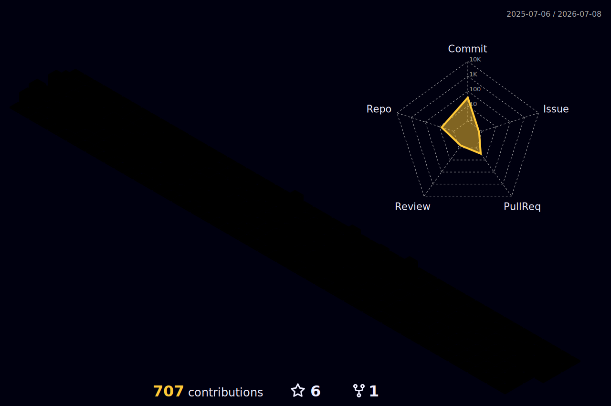

  

  
  
  
  

##  About me

- 🗺️ Fullstack dev at **ELDA Technology** — GIS platform mapping **LIDAR data** for ski resorts 🎿
- ⚡ TypeScript first: **React · Next.js · React Native · NestJS** — plus native Android in **Kotlin**
- ⛓️ **Alyra-certified** blockchain dev — Solidity, Foundry, Wagmi & Viem
- 📍 Toulouse · Master's student · **Open to new opportunities**

 

<table width="100%">
<tr>
<td width="50%" valign="top">

<h3 align="center">Tech stack</h3>

<strong>Languages</strong>

<strong>Frontend & Mobile</strong>

<strong>Backend & Geodata</strong>

<strong>Web3 / EVM</strong>

<strong>DevOps & Tools</strong>

</td>
<td width="50%" valign="top">

<h3 align="center">Contributions & Stats</h3>

</td>
</tr>
</table>

  

